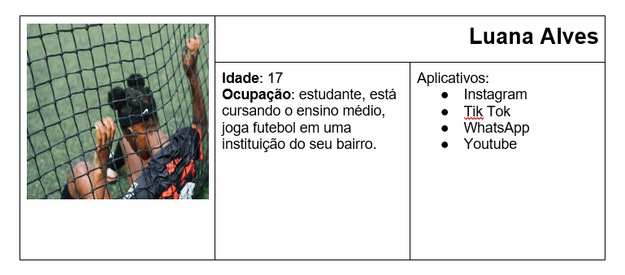
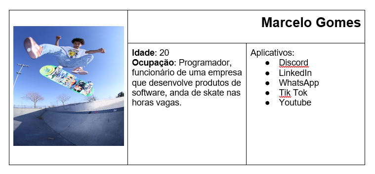
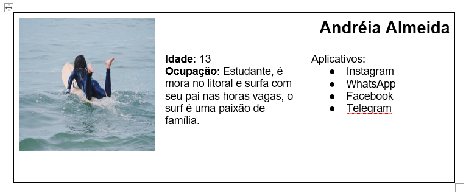
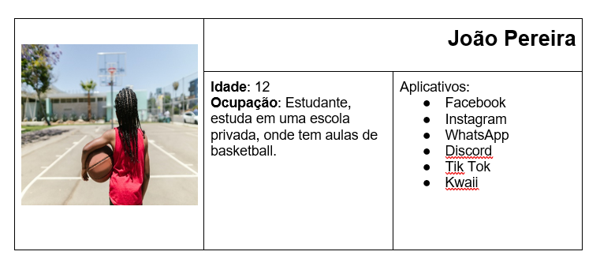

# Especificações do Projeto

Pré-requisitos: <a href="1-Documentação de Contexto.md"> Documentação de Contexto</a>

A definição do problema e os pontos mais relevantes a serem tratados neste projeto foi sugerido pela falta de portais de notícias esportivas para o público-alvo. Os detalhes levantados nesse processo foram consolidados na forma de personas e histórias de usuários.
## Personas

As personas levantadas durante o processo de entendimento do problema são apresentadas na Figuras que se seguem.

 ### Luana Alves

 ### Marcelo Gomes
 
 

### 	Andréia Almeida

### João Pereira 

## Histórias de Usuários

Com base na análise das personas forma identificadas as seguintes histórias de usuários:

|EU COMO... `PERSONA`| QUERO/PRECISO ... `FUNCIONALIDADE` |PARA ... `MOTIVO/VALOR`                 |
|--------------------|------------------------------------|----------------------------------------|
|Luana Alves         | Ler notícias esportivas mais relevantes do momento.                                           | Tomar ciência dos jogos de futebol que me interessam.|
|Marcelo Gomes       | Visualizar campeonatos de skate mais relevantes do meu país.                                  | Estar a par do que acontece no mudno do skate.       |
|Andréia Almeida     | Visualizar notícias específicas sobre surf.                                                   | Visualizar notícias que possam me interessar.        |
|João Pereira        | Ler sobre temas ligados a basketball.                                                         | Navegar por um site com notícias de basketball       |

## Requisitos

As tabelas que se seguem apresentam os requisitos funcionais e não funcionais que detalham o escopo do projeto.

### Requisitos Funcionais

|ID    | Descrição do Requisito  | Prioridade |
|------|-----------------------------------------------------------------------------------------------------------------------------|------|
|RF-01| O site deve apresentar na página principal notícias esportivas obtidas por meio de canais confiáveis.                       | ALTA | 
|RF-02| O site deverá apresentar atrativos visuais.                                                                                 | ALTA |
|RF-03| O site deverá apresentar notícias dinâmicas.                                                                                | MÉDIA | 
|RF-04| Agregar ao site um menu de busca para que o usuário possa buscar notícias específicas bem como deverá ter um menu adicional para que o usuário possa buscar notícias especificas.                                                                                                                         | ALTA |
|RF-05| Permitir visualizar os criadores e mantenedores desse site                                                                  | MÉDIA/ALTA | 
|RF-06| Agregar ao site o botão compartilhar para as redes sociais (Facebook, Twitter, Instagram).                                  | MÉDIA |
|RF-07| O site deve exibir os comentários registrados juntamente com a notícia exibida e deve permitir que usuários possam comentar.| BAIXA |

### Requisitos não Funcionais

|ID     | Descrição do Requisito  |Prioridade |
|-------|-------------------------|----|
|RNF-01| O site deverá ser publicado em ambiente público e acessível. | ALTA | 
|RNF-02| O site deverá ser responsivo permitindo a visualização em dispositivos móveis. (Celular, Tablet)|  MÉDIA | 
|RNF-03| O site deverá ser compatível aos navegadores usados atualmente (Chrome, Mozilla, Edge) |  ALTA | 

## Restrições

O projeto está restrito pelos itens apresentados na tabela a seguir.

|ID| Restrição                                             |
|--|-------------------------------------------------------|
|RE-01| O projeto deverá ser entregue no final do semestre letivo, não podendo extrapolar a data de 06/12/2021. |
|RE-02| O aplicativo deve se restringir às tecnologias básicas da Web no Front-end (HTML, CSS e JavaScript)        |
|RE-03| A equipe não pode subcontratar o desenvolvimento do trabalho.        |

