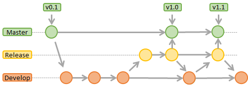

# Metodologia

Pré-requisitos: <a href="2-Especificação do Projeto.md"> Documentação de Especificação</a>

A Metodologia compreende os recursos e as ferramentas que serão aplicadas no decorrer do desenvolvimento do portal, elaboração dos códigos e os processos empregados na execução do projeto.

## Controle de Versão

A ferramenta de controle de versão adotada no projeto foi o
[Git](https://git-scm.com/), sendo o [Github](https://github.com) utilizado para hospedagem do repositório. Para gestão do código fonte do software desenvolvido pela equipe, o grupo utiliza um processo baseado no Git Flow abordado por Vietro (2015), mostrado na Figura a seguir. Desta forma, todas as manutenções no código são realizadas em branches separados, identificados como Release e Develop.

O projeto segue a seguinte convenção para o nome de branches:

- `Master`: versão estável já testada do software
- `Release`: versão de software desenvolvida, porém em teste ou testada, mas instável
- `Develop`: versão de desenvolvimento do software

## Gerenciamento de Projeto

### Divisão de Papéis

-	Scrum Master: Felipe Augusto Rocha da Silva
- Product Owner: Gabriel Garcia
- Equipe de Desenvolvimento: 
  - Gabriel Garcia
  - Felipe Augusto Rocha da Silva
  - Leonardo Filter Friedrich
  - Rafael Vitor França
- Design: 
  - Gabriel Garcia
  - Leonardo Filter Friedrich

### Processo

-	Backlog: recebe as tarefas a serem trabalhadas e representa o Product Backlog. Todas as atividades identificadas no decorrer do projeto também devem ser incorporadas a esta lista.
-	To Do: Esta lista representa o Sprint Backlog. Este é o Sprint atual que estamos trabalhando.
-	In progress: Quando uma tarefa tiver sido iniciada, ela é movida para cá.
-	Test: Checagem de Qualidade. É nesta etapa que damos um double check para verificar que a funcionalidade está estável.
-	Done: nesta lista são colocadas as tarefas que passaram pelos testes e controle de qualidade e estão prontos para ser entregues ao usuário. Não há mais edições ou revisões necessárias, ele está agendado e pronto para a ação.

O quadro kanban do grupo no  está disponível através da URL: https://github.com/ICEI-PUC-Minas-PMV-ADS/pmv-ads-2021-2-e1-proj-web-t1-informacoes-legislativas/projects/1

### Ferramentas

As ferramentas empregada no projeto:

|`Ambiente`|`Plataforma` |`Link de Acesso` |
|:------------------:|:------------------:|:------------------:|
|Desenvolvimento do código|VS code||
|Repositório de código fonte|GitHub|https://github.com/ICEI-PUC-Minas-PMV-ADS/pmv-ads-2021-2-e1-proj-web-t1-informacoes-legislativas|
|Projeto de Interface|marvelapp|https://marvelapp.com/prototype/2bj6456g|
|Gerenciamento do Projeto|GitHub|https://github.com/ICEI-PUC-Minas-PMV-ADS/pmv-ads-2021-2-e1-proj-web-t1-informacoes-legislativas/projects/1|

 

